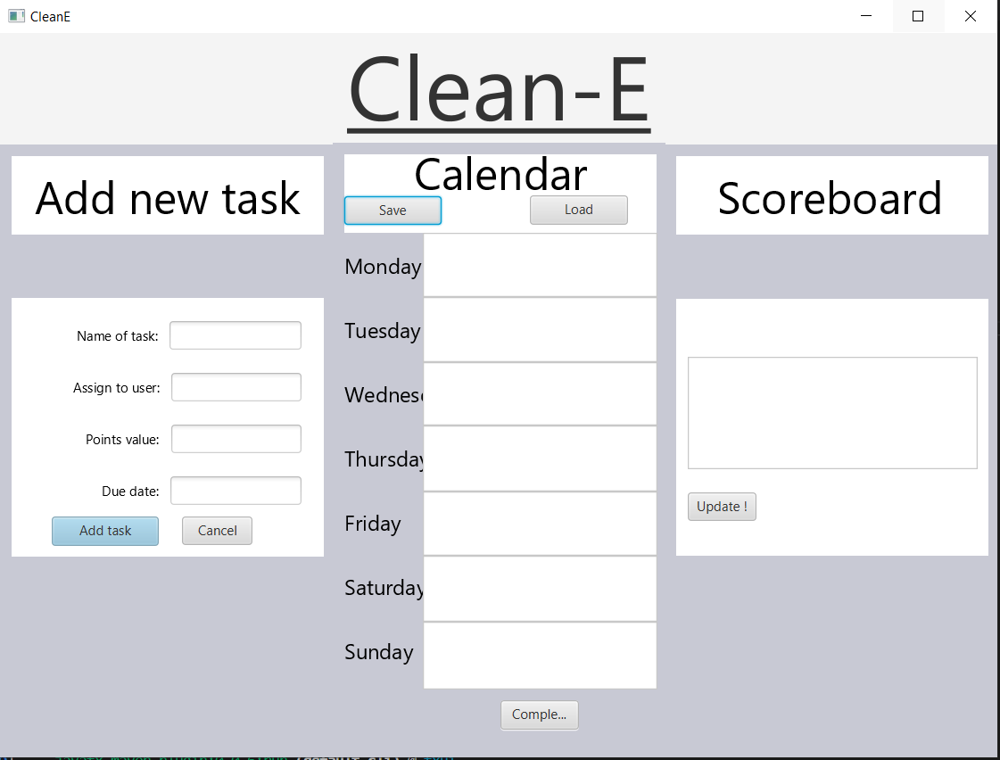

<h1>Clean-E Prosjektet</h1>

En app som håndterer rengjøringsoppgaver i form av en ukeskalender hvor oppgavene vises. Det er også en poengtabell hvor alle som deltar vil være med. Hver oppgave gir et antall poeng som går til personen som utfører oppgaven. Poengtabellen vil dermed endre seg basert på hvor mange oppgaver som blir gjort og man vil til slutt få en vinner.

<h3>Bilder: </h3>

<small><em >Second draft of Clean-E</em></small>

<u><h1>**Brukerhistorier**</h1></u>
Her samler vi brukerhistorier som har til hensikt å (av)dekke krav som systemet må tilfredsstille.
Det finnes ulike former for brukerhistorier, med mer eller mindre stramme krav om form, her gjør vi det nokså uformelt,
men prøver å oppsummere hver av dem litt strukturert.

<em><u><h3>Cleaning list (user1)</h3></u></em>

Som student som bor i kollektiv er det viktig for meg at rengjøring av kollektivet er noe alle bidrar med og derfor at det er en felles oversikt over ulike oppgaver folk gjør. 

Derfor er det viktig at brukerne til applikasjonen kan delegere oppgaver til seg selv og andre. Oppgavene har informasjon om navnet til personen som skal utføre oppgave, hvilken dag oppgaven skal utføres, og poeng til hver oppgave. Brukere skal kunne se sine egne og andre sine oppgaver.

Viktig å kunne se :
- Egne oppgaver
- Andres oppgaver

Viktig å kunne gjøre :
- Legge til en ny oppgave

<em><u><h3>Clean-E (user2)</h3></u></em>

Som student som bor i kollektiv er det viktig for meg at rengjøring av kollektivet er noe alle bidrar med og derfor at det er en felles oversikt over ulike oppgaver folk gjør. Derfor er det perfekt for å finne ut hvilke oppgaver som er deles ut mellom oss som bor sammen, og hvem som har gjort hva. Poengsystemet hjelper oss til å bli i en konkurranse med hverandre. 

Viktig å kunne se : 

- oversikt over hvem som er ansvarlig på hvilken oppgave.
- finne ut hvem og hvor mye poeng som er skaffet.

Viktig å kunne gjøre:

- legge inn ny task og user.
- fjerne task og user fra Calender listen etter det et komplett.
- addere poeng til user.
- ser scoreboard listen er oppdatert med det nyeste poeng.

<em><u><h3>Clean-E (user3)</h3></u></em>

I mitt kollektiv har vi allerede et poengsystem som føres med penn og papir. Vi har lyst til å gå over til et lignende system, men som vi kan bruke digitalt.

Viktig å kunne se : 

- oversikt over hvem som er ansvarlig på hvilken oppgave.
- finne ut hvem og hvor mye poeng som er skaffet.

Viktig å kunne gjøre:

- legge inn poengene og brukerne vi allerede har laget på penn og papir.
- legge inn ny task.
- fjerne task og user fra Calender listen etter det et komplett.
- addere poeng til user.
- ser scoreboard listen er oppdatert med det nyeste poeng.

