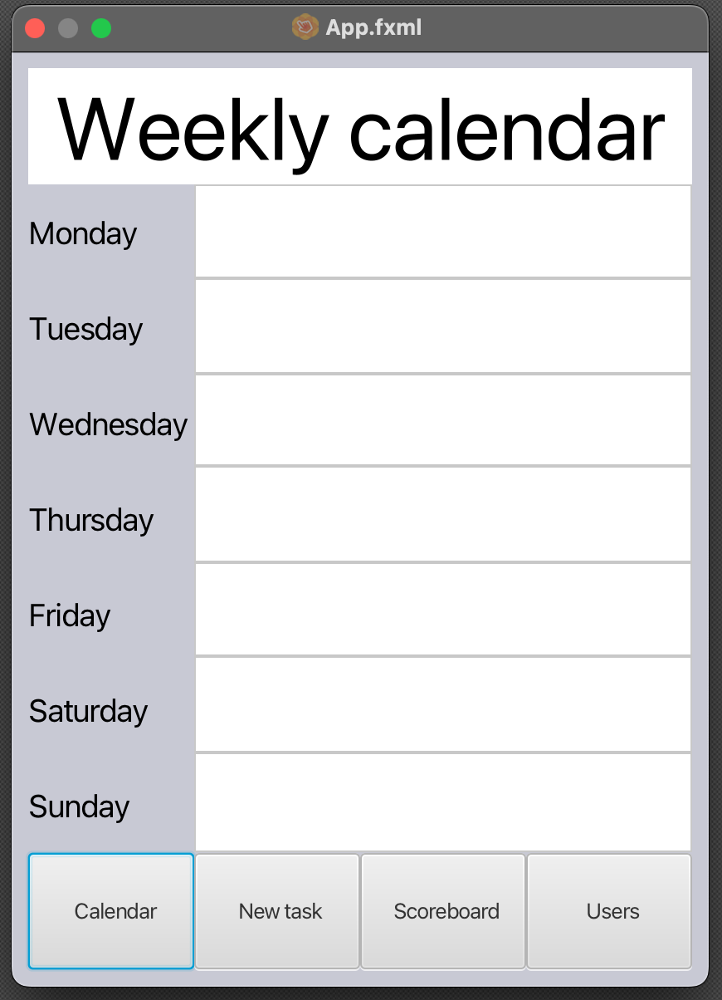
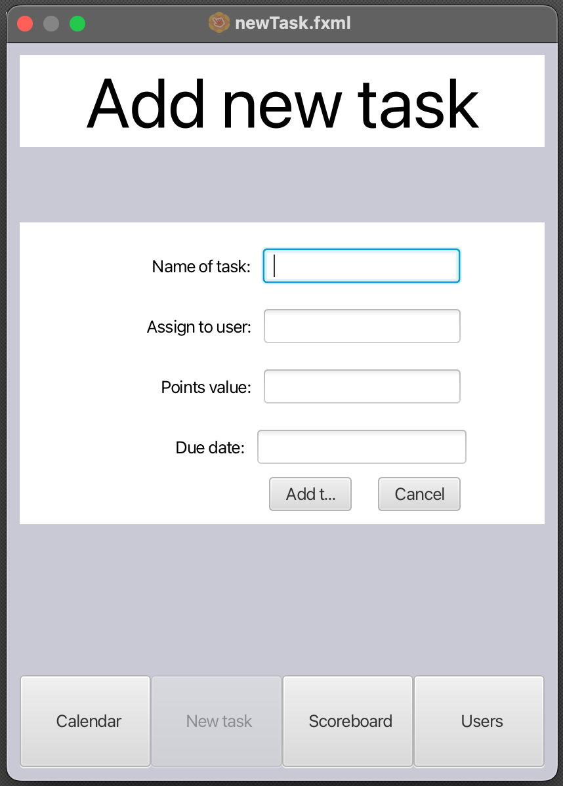

<u><h3>**Introduksjon**</h3></u>

Clean-E er en applikasjon for behandling/delegering av rengjøringsoppgaver. Applikasjonen er implementert av en JavaFX-app og håndtering av data er lagret lokalt. 

<small><em >First draft of Clean-E</em></small>

<small><em >First draft of newTask</em></small>

<u><h3>**Arkitekturen**</h3></u>

Applikasjonen bruker brukergrensesnittet som står i senteret. Brukere skal interagere mest på den, og systemet skal behandle alle av de informasjonene som er lagret av brukere, ie. vises informasjon og/eller addere "ny task".

<u><h3>**Modularisering**</h3></u>

Clean-E prosjektet er sett-moduler strukturert. Prosjektet er tildelt i nemlig en brukergrensesnitt, og fillagring.

_Applikasjonfiler_

- [Clean-E App](gr2244/src/main/java/cleane/CleanEApp.java) => Filen inneholder main kode for å kjøre appen.

- [Clean-E Controller](gr2244/src/main/java/cleane/CleanEController.java) => Filen inneholder kode som er knyttet til GUI fil "App.fxml"

- [Clean-E File Management](gr2244/src/main/java/cleane/FileManagement.java) => Filen håndteres enten Read/Write funksjonen til "Leaderboard.java"

- [Clean-E Leaderboard](gr2244/src/main/java/cleane/Leaderboard.java) => Filen inneholder kode hvor brukere blir sorteres i en liste i følge poengene sine.

- [Clean-E Task](gr2244/src/main/java/cleane/Task.java) => Filen inneholder kode hvor en bruker kan bli tildelt med en "task".

- [Clean-E User](gr2244/src/main/java/cleane/User.java) => Filen inneholder informasjon for hver brukere.

_Brukergrensesnitt_

- [Clean-E App](gr2244/src/main/java/resources/App.fxml) => Filen inneholder main bruker GUI som er knyttet til kontrolfilen "CleanEController.java"

- [NewTask](gr2244/src/main/java/resources/newTask.fxml) => Filen inneholder bruker GUI som er knyttet til kontrolfilen "CleanEController.java"

_Lagringfiler_

- [cleane.txt](gr2244/savestates/cleane.txt) => Filen inneholder lagring informasjon fra "newTask.fxml"

