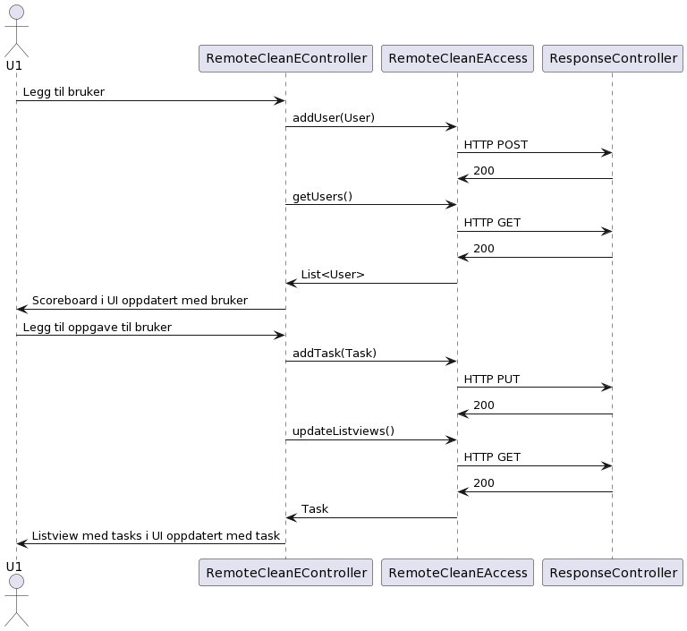
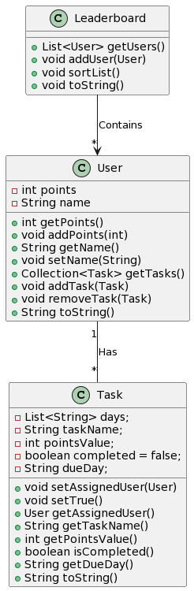

<h1> Innlevering 3</h1>

I denne iterasjonen har vi utvidet funksjonaliteten i CleanE enda en gang. I den forrige iterasjonen kunne man kunne lage nye brukere ved å lage en oppgave. Det ble da implisitt laget en bruker. Dette funket fint, men vi tenkte at det kunne være lurt å ha muligheten for å lage brukere eksplisitt. Dette kunne være nyttig hvis man for eksempel allerede hadde en bruker som hadde opptjent poeng før man hadde startet å bruke denne applikasjonen.

I denne iterasjonen har vi også implementert REST API. <b>-*TODO*-</b>

Vi har også gjort noen mindre endringer som å fjerne oppdateringsknappen fra poengtabellen, slik at den nå oppdateres og sorteres automatisk når man brukere blir lagt til og oppgaver utføres.
 
 
<h1>Diagrammer</h1>
<h2>Sekvensdiagram</h2>

<h2>Klassediagram Core</h2>

 

<u><h1>Viktig info!</u></h1>
Grunnen til at vi leverer sent er på grunn av sykdom. Flere av gruppemedlemmene har vært syke i varierende grad, og en har hatt streptokokker, noe som har gjort det krevende for oss å jobbe i like høyt tempo som forventet. Vi ber derfor om forståelse for at vi leverer sent.