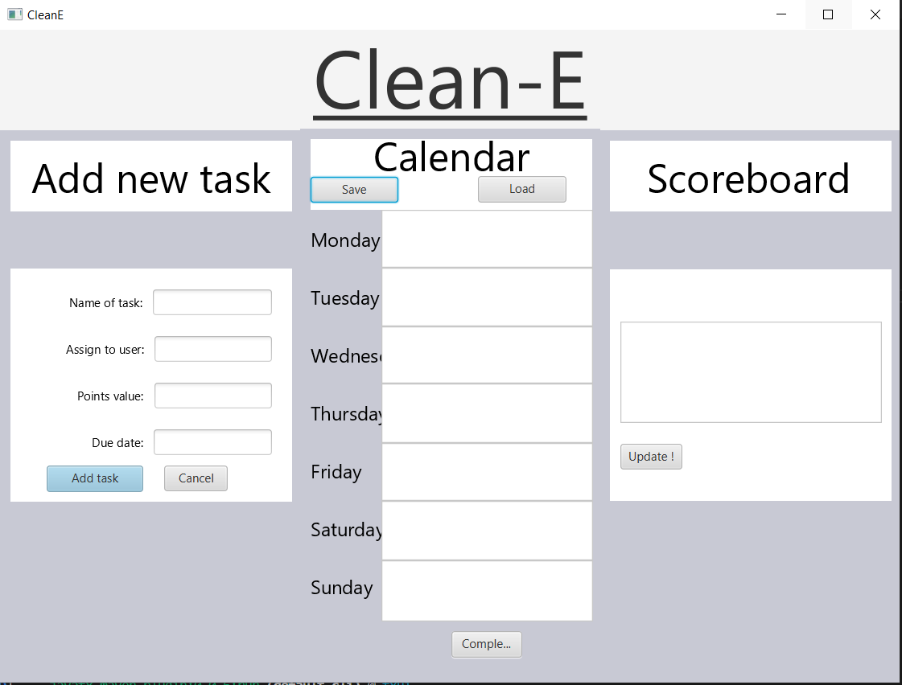

<h1>Clean-E 2.0 Prosjektet</h1>

En app som håndterer rengjøringsoppgaver i form av en ukeskalender hvor oppgavene vises. Det er også en poengtabell hvor alle som deltar vil være med. Hver oppgave gir et antall poeng som går til personen som utfører oppgaven. Poengtabellen vil dermed endre seg basert på hvor mange oppgaver som blir gjort og man vil til slutt få en vinner.

<u><h3>Bilder: </h3>

<small><em >Second draft of Clean-E</em></small>

