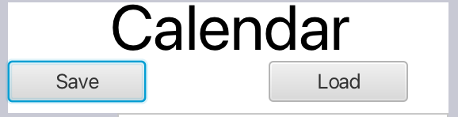

<h1>Bygging av prosjektet</h1>

Prosjektet bruker maven til bygging og kjøring. Gjør følgende operasjoner i terminalen (gitt at du starter fra rotnivå i terminalen):

- Steg 1: &emsp; <code>cd rest </code>
- Steg 2: &emsp; <code>mvn spring-boot:run </code>
- Steg 3: &emsp; Åpne så en ny terminal og skriv kommandoene i de neste stegene i denne terminalen
- Steg 4: &emsp; <code>cd CleanE </code>
- Steg 5: &emsp; <code>mvn clean install </code>
- Steg 6: &emsp; <code>mvn javafx:run -f fxui/pom.xml </code>

<h1>Innhold</h1>

[Om Appen](cleane/readme.md)

Inne i mappen CleanE/core/src vil man finne hovedfilene til prosjektet. Herfra er det delt inn i test og main. I main finnes selve programfilene til prosjektet. I test finnes JUnit testene. I CleanE/fxui/src/main finnes filene knyttet til brukergrensesnittet. I java/ui finner man kontrolleren-klassen og app-klassen. I resources/ui finner man selve brukergrensesnittet. I CleanE/rest finner man alle filer knyttet til rest api.

<u><h3> Core </h3></u>

_Core_

- [Clean-E Leaderboard](CleanE/core/src/main/java/core/Leaderboard.java) => Filen inneholder kode hvor brukere blir sorteres i en liste i følge poengene sine.

- [Clean-E Task](CleanE/core/src/main/java/core/Task.java) => Filen inneholder koden for task klassen.

- [Clean-E User](CleanE/core/src/main/java/core/User.java) => Filen inneholder koden for user klassen.

_Persistens_

- [JSON](CleanE/core/src/main/java/json) => Håndtering av hvordan fillagring håndteres med serialiserere og deserialiserer samt en Module-fil finnes i JSON-mappen, ingen lokalt.

<u><h3>FXUI</h3></u>

_UI_

- [Clean-E FXUI](CleanE/fxui/src/main/resources/ui/cleanE.fxml) => Filen inneholder hovedsiden GUI til alle : AddTask, Kalenderen, Fillagring /Loading & Leaderboard.

_App & Kontroller_

- [Clean-E App](CleanE/fxui/src/main/java/ui/CleanEApp.java) => Filen inneholder kode for å kjøre appen.

- [Clean-E Remote App](CleanE/fxui/src/main/java/ui/CleanERemoteApp.java) => Filen inneholder kode for å kjøre appen med REST API.

- [Clean-E Controller](CleanE/fxui/src/main/java/ui/CleanEController.java) => Filen inneholder kontrolleren.

- [Clean-E Remote Controller](CleanE/fxui/src/main/java/ui/CleanERemoteController.java) => Filen inneholder kontrolleren for å bruke REST API.

- [Clean-E Remote Controller](CleanE/fxui/src/main/java/ui/RemoteCleanEAccess.java) => Filen håndterer HTTP-forespørsler.

<u><h3>REST</h3></u>

- [Application](CleanE/rest/src/main/java/rest/Application.java) => Filen trengs for å starte REST-server.

- [CleanE Service](CleanE/rest/src/main/java/rest/CleanEService.java) => Filen setter opp Leaderboard i REST API.

- [Response Controller](CleanE/rest/src/main/java/rest/ResponseController.java) => Filen manipulerer Leaderboard i CleanE Service.

 
<h1>Testdekningsgrad</h1>
Ved å kjøre kommandoen <code>mvn test</code> opprettes en testdekningsrapport, som heter <b>index.html</b>.
Denne finner man ved å gå inn i mappen CleanE/core/target/site/jacoco. 
Når HTML-filen åpnes i nettleseren, så får man frem prosjektets testdekningsgrad.

 
<h1> Arbeidsvaner og arbeidsflyt </h1>

I den siste iterasjonen av prosjektet har vi fortsatt vår gode vaner ved å bruke gitlab som et verktøy i utviklingsprosessen vår. Vi har laget utviklingsoppgaver (issues) i gitlab som beskriver alt vi har gjort. For hver utviklingsoppgave har vi branchet slik at det man arbeider med ikke skaper problemer med det noen andre arbeider med. Vi har også vært flinke på å nevne issue nummer i commit-meldingene slik at man enkelt kan se hvilke commits som relaterer til hvilke issues når alle branchene har blitt satt sammen i master. Vi har også fortsatt å benyttet oss mye av parprogrammering i denne iterasjonen. Dette kan man se i commit-meldingene der vi har skrevet "Medforfattet av @brukernavn". Vi har også i denne iterasjonen brukt peer-review når vi merger ulike branches og lagt igjen kommentarer hvis det var noe som burde endres før merging.

<h1> Dokument-metafor vs. implisitt lagring</h1>

I andre iterasjon av prosjektet valgte vi dokument-metafor i stedet for implisitt lagring, fordi vi trodde dette ville gjøre det lettere for brukeren av appen å skjønne når ting lagres. Det vil si at brukerne selv valgte hvis de vil overskrive listen som er allerede lagret for å begynne på nytt.

Appen lagret brukernes informasjon tilstanden til programmet hver gang man trykker på SAVE knappen, og laster inn informasjonen fra filen til programmet med LOAD knappen.

I den tredje iterasjonen har vi endret lagringen til å bli implisitt. Det vil si at lagringen til fil og lastingen fra fil skjer automatisk, endrer tilstanden til programmet. Vi oppdaget at det var mange unødvendige tastetrykk når vi hver gang vi åpnet programmet måtte trykke på load-knappen for å laste fra fil. Vi mener dette gir en bedre brukeropplevelse.

<small><em >Save/Load</em></small>

